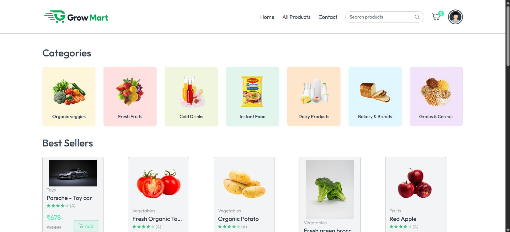

# 🛒 Grow-Mart – Online Grocery Store

Grow-Mart is a **full-stack MERN (MongoDB, Express, React, Node.js)** grocery app. Customers can browse products, manage a shopping cart, save addresses, and place orders via **Cash on Delivery (COD)** or **Stripe Online Payments**. Sellers/Admins can manage products and view all orders.

👉 Live demo: [grow-mart.vercel.app](https://grow-mart.vercel.app)

---

##  Features

###  User
- Register & login using JWT & cookies
- Browse categories and products with offers
- Add/remove items in the cart
- Save delivery addresses
- Checkout with:
  - **Cash on Delivery (COD)**
  - **Stripe Online Payment** (secure with webhook order updates)
- View order history and real-time payment status

###  Seller/Admin
- Secure login (email + password via environment vars)
- Add / edit / delete products (with images hosted on Cloudinary)
- View all customer orders with payment status

---

##  Tech Stack

| Layer      | Technology                          |
|------------|--------------------------------------|
| Frontend   | React + Vite, Tailwind CSS           |
| Backend    | Node.js, Express, JWT auth           |
| Database   | MongoDB Atlas with Mongoose ODM      |
| Storage    | Cloudinary for product images        |
| Payments   | Stripe Checkout & Webhooks           |
| Hosting    | Vercel (frontend ), render (backend) |

---
## 📸 Screenshots

### 👤 User Side
- **Home Page**
  
